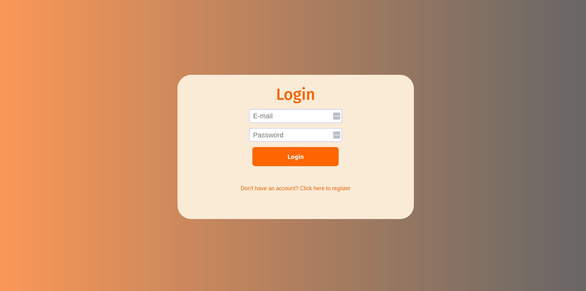
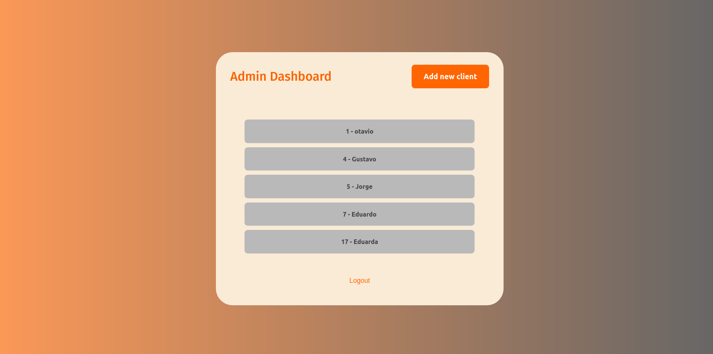
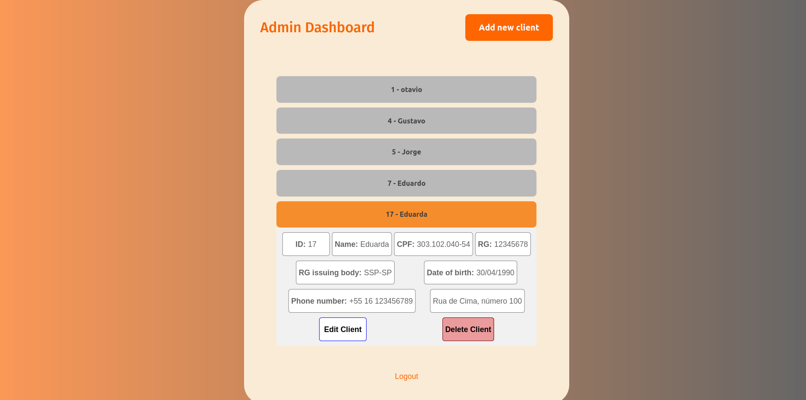

# Admin dashboard

Este repositório contém o projeto de um painel de administrador para gerenciar clientes cujo backend foi feito em Python, o front em React.js e o banco de dados utilizado foi o MySQL.

## Executando o projeto

Caso possua Docker e docker-compose instalado em sua máquina, é possível executar o projeto da seguinte maneira:

```
git clone git@github.com:kundlatsch/admin-dashboard.git
cd admin-dashboard
docker-compose up --build
```

Para executar localmente é necessário possuir uma instalação própria do MySQL. É possível executá-lo com docker através do comando: 
`docker run --name some-mysql -e MYSQL_ROOT_PASSWORD=my-secret-pw -d mysql:5.7`

Para executar o backend edite o arquivo `backend/admin_dashboard/db.py` com as credenciais do seu banco. Após isso, é recomendado instalar as dependências com o [pipenv](https://pypi.org/project/pipenv/):

```
cd backend
pipenv shell
pipenv install --skip-lock
python run.py
```

Para executar o frontend siga a instalação padrão de projetos React:

```
cd frontend
npm install
npm start
```

## Decisões

A proposta inicial do exercício era desenvolver o backend em PHP sem o uso de frameworks. Como foi disponibilizado a chance de fazer em outra linguagem, optei por Python por familiaridade. Para manter o conceito de não usar frameworks, foi utilizado apenas Flask sem extensões que ajudem no desenvolvimento de APIs REST e sem nenhum ORM. O frontend em React foi escolhido apenas por familiaridade com a ferramenta.

## Melhorias

Diversas melhorias podem ser feitas no projeto, como (mas não limitado a):

* Backend
    - Tratamento da expiração dos tokens JWT
    - Mover variáveis sensíveis para variáveis de ambiente
    - Adicionar paginação nas rotas de clientes e endereços
* Frontend
    - Adicionar animações para melhorar a experiência do usuário
    - Organizar melhor o CSS das páginas
    - Componentizar mais o projeto
    - Adicionar paginação nas listagens de clientes e endereços
* Testes: Apenas alguns poucos testes foram adicionados para criar a estrutura. É necessário adicionar mais testes de unidade.

## Imagens




